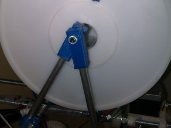

Filament spool coupler
===============

Filament spool coupler  by algspd , published Sep 5, 2012

Description
--------
Filament spool coupler

Instructions
--------
This filament spool coupler will allow you to put your filament spool over your Prusa printer (may fit on other printers). 
 
You will need: 
- 4 "Filament spool coupler" 
- 8 bar clamps 
- 2 8mm diameter threaded rod (length &gt; spool width) 
- 4 8mm diameter smooth rod (length &gt; spool radius) 

License
--------
Filament spool coupler by algspd is licensed under the Creative Commons - Attribution - Share Alike license.  

By: Javier Briz (algspd)
--------
<http://javierbriz.com/>